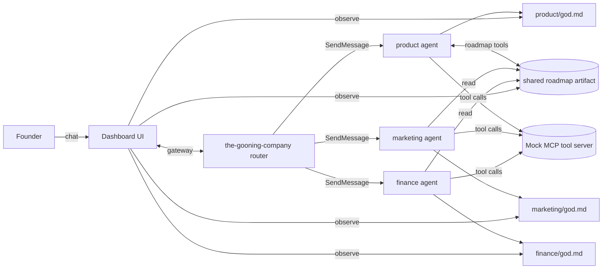

# Objective

The aim is an **agent harness for three company functions**:

1. Product / UX  
2. Marketing  
3. Finance  

Give founders **decision-making leverage**: reduce friction between **sparse but costly** workflows (the handoffs that are easy to defer but expensive when they slip). Each function is a **long-running** OpenHarness agent with its own scope, concerns, and system prompt; they share a harness (tool loop, MCP, skills, memory, multi-agent primitives) but **not** each other’s private state.

The system **cascades** changes through a single router so Marketing and Finance react when Product moves the roadmap (and vice versa where contracts allow).

OpenHarness provides the harness. For capabilities and usage patterns, see [`docs/SHOWCASE.md`](https://github.com/HKUDS/OpenHarness/blob/main/docs/SHOWCASE.md) and the project [`README.md`](https://github.com/HKUDS/OpenHarness/blob/main/README.md). **When behavior is unclear, read upstream OpenHarness docs** (SHOWCASE, README, CHANGELOG) rather than guessing.

---

## System topology

Four **independent, long-running** agents (ohmo-style workspaces): one **router** plus three **domain** agents. Domain agents do **not** message each other; all cross-domain effects go through **`the-gooning-company`** (router), which dispatches (e.g. `SendMessage` / gateway) to the right agent(s).

The founder talks to **`the-gooning-company`**: a **simple router and basic context enricher** — not the domain agents directly for cross-cutting asks.

- **`the-gooning-company` (router)** — Entry point for founders; routes intent, enriches context, brokers cascades. No peer-to-peer between domain agents.
- **Product / UX** — Owns edits to the shared roadmap artifact; proposes roadmap changes that trigger downstream cascades via the router.
- **Marketing** — Reads roadmap; owns campaigns and positioning in its `god.md`; signals that need roadmap or finance follow-up go to the router.
- **Finance** — Reads roadmap; owns projections and implications in its `god.md`; reacts to roadmap and marketing-relayed events via the router.

---

## Core concepts

1. **`god.md` (per agent, private)**  
   Each domain agent has one **private** living markdown file: the **active living doc** for that function — worldview, decisions, running notes. **Peer agents do not read each other’s `god.md`.** Observability for founders is via the **dashboard** (see below), not direct agent-to-agent file access.

2. **Shared product roadmap (separate artifact)**  
   A **single shared artifact** (format TBD in [`dev-concepts/README.md`](dev-concepts/README.md)) **owned by Product**, readable by Marketing and Finance. Mutations go through **`roadmap.*`** tools on the mock MCP server, not ad-hoc edits by non-owners.

   **Product intent:** the roadmap is **foundational** — it should read like work across **domains** (Product / Marketing / Finance), with **status** and **high-level** columns, almost a **kanban board**. In practice it **drives the company**: roadmap changes **cascade** into implications elsewhere (e.g. financial projections, campaign timing). The other direction matters too: if **Marketing** sees a gap or conflict, that should surface as a **roadmap item** (via the router to Product), so the artifact stays a **living doc** — a **decision-making panel** for founders, not a static slide.

3. **Router-brokered cascade**  
   “Automatic” cross-agent updates mean: domain agent finishes work → **router** receives outcome → router decides **who must know** → router dispatches. Example: roadmap change → router notifies Marketing and Finance with summarized deltas (downstream can spin **new projections, implications, or campaign adjustments**). Example: new marketing campaign → router notifies Finance. Marketing **does not** append to Product’s `god.md`; it may request a roadmap item via tools/messages that the router forwards to Product.

4. **Mock MCP tool server (one server, namespaced tools)**  
   This is a **hackathon** project: tool calls can be **fake** with **mocked** payloads, but we still host a **tool server / MCP** so the loop looks like production — structured inputs/outputs and clear ownership. One MCP server exposes namespaced tools: `product.*`, `marketing.*`, `finance.*`, and shared `roadmap.*`. Value is in **contracts and cascade**, not real CRM/accounting/API integrations.

---

## Agent contracts

Roles, tools, and event vocabulary are specified in [`Product-requirement-doc/README.md`](Product-requirement-doc/README.md) (index + per-agent stubs).

We are converging the PRD on:

- **What tools to expose** (per agent + shared roadmap)  
- **Communication contracts** (router messages, event names, payloads)  
- **Interconnects** between agents so the **workflow** is explicit end-to-end  

---

## Dashboard

Primary **founder surface**: chat with the **router** here, plus live views of:

- Shared **roadmap** (dynamic kanban),
- Each agent’s **`god.md`** (read-only observability for founders),
- **Cascade trace** (what the router sent, to whom, and why).

---

## Hackathon scope

Tool responses may be **mocked**. Fidelity targets: **clear contracts**, **router-brokered cascades**, and **dashboard observability** — not production integrations.

---

## Where things live

| Area | Location |
|------|----------|
| Per-agent roles, tools, cascade events | [`Product-requirement-doc/`](Product-requirement-doc/README.md) |
| Implementation invariants: workspace layout, roadmap schema, MCP naming, **how context is injected**, dashboard plumbing | [`dev-concepts/`](dev-concepts/README.md) |
