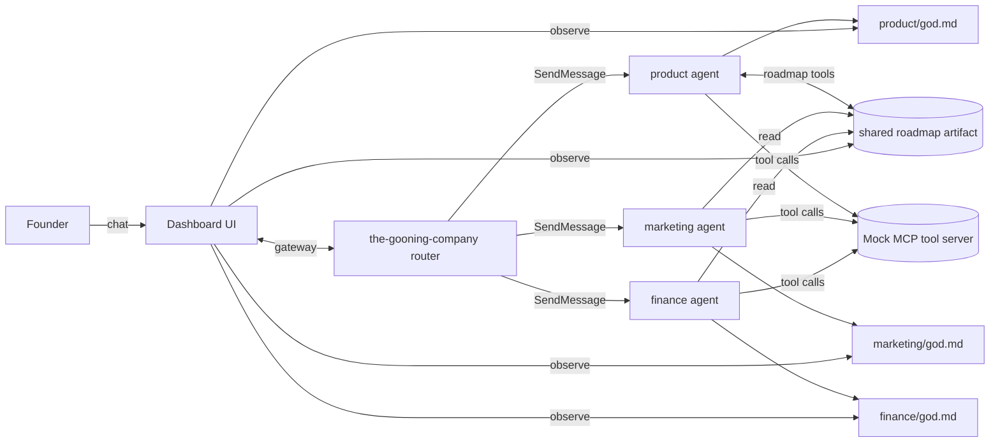

# Objective

Give founders **decision-making leverage** by running three domain agents (Product/UX, Marketing, Finance) on [OpenHarness](https://github.com/HKUDS/OpenHarness), each holding durable state for their function. The system reduces friction between sparse but high-cost company workflows by **cascading** changes through a single router so Marketing and Finance react when Product moves the roadmap (and vice versa where contracts allow).

OpenHarness provides the harness: tool loop, MCP, skills, memory, multi-agent primitives. For capabilities and usage patterns, see [`docs/SHOWCASE.md`](https://github.com/HKUDS/OpenHarness/blob/main/docs/SHOWCASE.md) and the project [`README.md`](https://github.com/HKUDS/OpenHarness/blob/main/README.md). When unsure about harness behavior, prefer those docs.

---

## System topology

Four **independent, long-running** agents (ohmo-style workspaces): one **router** plus three **domain** agents. Domain agents do **not** message each other; all cross-domain effects go through **`the-gooning-company`** (router), which dispatches (e.g. `SendMessage` / gateway) to the right agent(s).

- **`the-gooning-company` (router)** — Entry point for founders; routes intent, enriches context, brokers cascades. No peer-to-peer between domain agents.
- **Product / UX** — Owns edits to the shared roadmap artifact; proposes roadmap changes that trigger downstream cascades via the router.
- **Marketing** — Reads roadmap; owns campaigns and positioning in its `god.md`; signals that need roadmap or finance follow-up go to the router.
- **Finance** — Reads roadmap; owns projections and implications in its `god.md`; reacts to roadmap and marketing-relayed events via the router.

---

## Core concepts

1. **`god.md` (per agent, private)**  
   Each domain agent has one **private** living markdown file: worldview, decisions, running notes for that function. **Peer agents do not read each other’s `god.md`.** Observability for founders is via the **dashboard** (see below), not direct agent-to-agent file access.

2. **Shared product roadmap (separate artifact)**  
   A **single shared artifact** (format TBD in [`dev-concepts/README.md`](dev-concepts/README.md)) **owned by Product**, readable by Marketing and Finance. Mutations go through **`roadmap.*`** tools on the mock MCP server, not ad-hoc edits by non-owners. The dashboard shows it as a **kanban-style** view (domains, status, high level).

3. **Router-brokered cascade**  
   “Automatic” cross-agent updates mean: domain agent finishes work → **router** receives outcome → router decides **who must know** → router dispatches. Example: roadmap change → router notifies Marketing and Finance with summarized deltas. Example: new marketing campaign → router notifies Finance. Marketing **does not** append to Product’s `god.md`; it may request a roadmap item via tools/messages that the router forwards to Product.

4. **Mock MCP tool server (one server, namespaced tools)**  
   One MCP server exposes **fake** but structured tool calls: `product.*`, `marketing.*`, `finance.*`, and shared `roadmap.*`. Hackathon-appropriate mocked data is fine; value is in **contracts and cascade**, not production integrations.

---

## Agent contracts

Roles, tools, and event vocabulary are specified in [`Product-requirement-doc/README.md`](Product-requirement-doc/README.md) (index + per-agent stubs).

---

## Dashboard

Primary **founder surface**: chat with the **router** here, plus live views of:

- Shared **roadmap** (dynamic kanban),
- Each agent’s **`god.md`** (read-only observability for founders),
- **Cascade trace** (what the router sent, to whom, and why).

---

## Hackathon scope

Tool responses may be **mocked**. Fidelity targets: **clear contracts**, **router-brokered cascades**, and **dashboard observability** — not real CRM/accounting/API integrations.

---

## Where things live

| Area | Location |
|------|----------|
| Per-agent roles, tools, cascade events | [`Product-requirement-doc/`](Product-requirement-doc/README.md) |
| Implementation invariants (workspace layout, roadmap schema, MCP naming, context injection) | [`dev-concepts/`](dev-concepts/README.md) |
