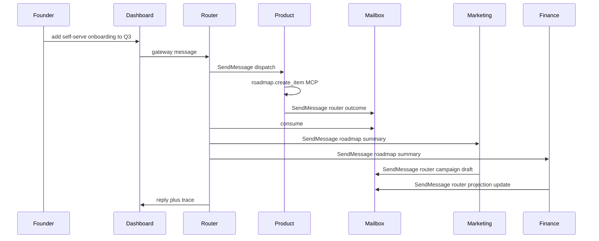

# Dev concepts — implementation invariants

Companion to root [`AGENTS.md`](../AGENTS.md). **Product** contracts live in [`../Product-requirement-doc/`](../Product-requirement-doc/README.md).

This doc ties our design to **concrete OpenHarness / ohmo primitives** (paths, env vars, subsystems). Upstream source of truth: [OpenHarness](https://github.com/HKUDS/OpenHarness).

**Locked for this repo**

- **`god.md`**: lives at `<workspace>/memory/god.md` per agent; picked up by ohmo’s `load_ohmo_memory_prompt()` (no custom prompt assembly).
- **Cascade**: OpenHarness **swarm** — registry + mailbox + `SendMessage` + subprocess-backed teammates; no separate message bus.

---

## 1. OpenHarness primitives at a glance

| Our concept | OpenHarness / ohmo hook |
|-------------|-------------------------|
| Four isolated long-running agents | Four **ohmo workspaces** + `run_ohmo_backend(..., workspace=…)` ([`ohmo/runtime.py`](https://github.com/HKUDS/OpenHarness/blob/main/ohmo/runtime.py)); default root `~/.ohmo` or override via `OHMO_WORKSPACE` / `--workspace` ([`ohmo/workspace.py`](https://github.com/HKUDS/OpenHarness/blob/main/ohmo/workspace.py)) |
| System prompt stack (persona + memory) | `build_ohmo_system_prompt()` ([`ohmo/prompts.py`](https://github.com/HKUDS/OpenHarness/blob/main/ohmo/prompts.py)): base + `soul.md` + `identity.md` + `user.md` + `BOOTSTRAP.md` + **workspace memory** (`memory/`, incl. `MEMORY.md` index) + optional project `CLAUDE.md` via `load_project_memory_prompt` |
| Router-brokered fan-out | **Swarm**: [`src/openharness/swarm/registry.py`](https://github.com/HKUDS/OpenHarness/blob/main/src/openharness/swarm/registry.py), [`mailbox.py`](https://github.com/HKUDS/OpenHarness/blob/main/src/openharness/swarm/mailbox.py), [`team_lifecycle.py`](https://github.com/HKUDS/OpenHarness/blob/main/src/openharness/swarm/team_lifecycle.py), [`subprocess_backend.py`](https://github.com/HKUDS/OpenHarness/blob/main/src/openharness/swarm/subprocess_backend.py); harness tools `Agent` / `SendMessage` (see upstream README “Swarm Coordination”) |
| One mock tool server | MCP **client** in harness ([`src/openharness/mcp/client.py`](https://github.com/HKUDS/OpenHarness/blob/main/src/openharness/mcp/client.py)); configure per process via `--mcp-config` / settings; HTTP transport + auto-reconnect (v0.1.5+ changelog) |
| Enforce “Product owns roadmap writes” | [`src/openharness/permissions/`](https://github.com/HKUDS/OpenHarness/tree/main/src/openharness/permissions) — `path_rules`, modes; deny `roadmap.*` or filesystem writes outside policy per workspace `settings.json` |
| Optional reactive logging | [`src/openharness/hooks/`](https://github.com/HKUDS/OpenHarness/tree/main/src/openharness/hooks) — PreToolUse / PostToolUse for cascade trace / audit |
| Per-agent playbooks | `skills/`, `plugins/` under each workspace; `run_ohmo_backend` passes `extra_skill_dirs` / `extra_plugin_roots` ([`ohmo/runtime.py`](https://github.com/HKUDS/OpenHarness/blob/main/ohmo/runtime.py)) |
| Founder channels | `gateway.json` per workspace ([`ohmo/workspace.py`](https://github.com/HKUDS/OpenHarness/blob/main/ohmo/workspace.py)); Slack / Telegram / Discord / Feishu per upstream docs |
| Dashboard (candidate) | [`src/openharness/autopilot/service.py`](https://github.com/HKUDS/OpenHarness/blob/main/src/openharness/autopilot/service.py) + [`autopilot-dashboard/`](https://github.com/HKUDS/OpenHarness/tree/main/autopilot-dashboard); snapshot contract sketched in [`docs/autopilot/snapshot.json`](https://github.com/HKUDS/OpenHarness/blob/main/docs/autopilot/snapshot.json) |

---

## 2. Workspace layout (concrete ohmo paths)

Resolution order for workspace root ([`get_workspace_root`](https://github.com/HKUDS/OpenHarness/blob/main/ohmo/workspace.py)): explicit `workspace` argument → `OHMO_WORKSPACE` env → `~/.ohmo`.

**This repo** (suggested layout under the monorepo root):

| Directory | Agent |
|-----------|--------|
| `workspaces/router/` | `the-gooning-company` (router) |
| `workspaces/product/` | Product / UX |
| `workspaces/marketing/` | Marketing |
| `workspaces/finance/` | Finance |

Each directory is a full ohmo workspace. Seeded by `initialize_workspace()`; key paths from upstream:

| Path | Role |
|------|------|
| `soul.md` | Persona, boundaries (e.g. “router only”, “Product owns roadmap”) |
| `identity.md` | Short shape card for the agent |
| `user.md` | Founder profile / prefs (can be copied or symlinked across workspaces) |
| `BOOTSTRAP.md` | First-run ritual (optional; delete when done per upstream template) |
| `memory/` | Durable notes; includes `MEMORY.md` index + **`god.md`** (see §4) |
| `memory/MEMORY.md` | Index for memory corpus (template from `initialize_workspace`) |
| `skills/` | Agent-local skills (markdown) |
| `plugins/` | Claude-style plugin roots |
| `sessions/` | Session storage |
| `logs/` | Logs |
| `attachments/` | Attachments |
| `state.json` | Workspace state |
| `gateway.json` | Provider profile, channels, permission defaults |

**Spawn**: run ohmo / harness backend with `workspace=<repo>/workspaces/<role>` (equivalent to `run_ohmo_backend(..., workspace=workspace_root)` in [`ohmo/runtime.py`](https://github.com/HKUDS/OpenHarness/blob/main/ohmo/runtime.py)). Use CLI flags documented upstream (`ohmo --workspace …`, etc.).

---

## 3. Agent identity (`soul.md`, `identity.md`, `user.md`, `BOOTSTRAP.md`)

Upstream seeds default templates in [`initialize_workspace`](https://github.com/HKUDS/OpenHarness/blob/main/ohmo/workspace.py).

- **`soul.md`** — Role boundary and tone (router vs product vs marketing vs finance).
- **`identity.md`** — One-screen “who is this agent”.
- **`user.md`** — Who the founder is; keep in sync or symlink so all agents share the same facts.
- **`BOOTSTRAP.md`** — Optional first conversation; router may use a shorter bootstrap than domain agents.

---

## 4. `god.md` as workspace memory

**Rule:** each agent’s private living doc is:

```text
<workspace>/memory/god.md
```

**Why this works:** `build_ohmo_system_prompt()` loads workspace memory via `load_ohmo_memory_prompt(root)` after the soul/identity/user/bootstrap sections ([`ohmo/prompts.py`](https://github.com/HKUDS/OpenHarness/blob/main/ohmo/prompts.py)). Content under `memory/` is the supported place for durable agent-local context.

- Agents maintain `god.md` with normal harness file tools (`Read` / `Write` / `Edit`).
- **Invariant:** `god.md` does **not** hold the canonical roadmap backlog. The shared roadmap artifact (§5) remains source of truth for kanban rows; `god.md` holds worldview, decisions, and notes for that function only.

---

## 5. Shared roadmap artifact (outside ohmo workspaces)

**Rule:** keep the canonical roadmap **outside** the four workspace trees so it is clearly shared, e.g.:

```text
state/roadmap.md
```

or `state/roadmap.json` / split representation — **format TBD** in [`roadmap-schema.md`](roadmap-schema.md) (stub; see §11).

- **Read:** all agents may read `state/roadmap.*` (subject to cwd / permission rules).
- **Write:** only **Product** should mutate files under `state/` for roadmap content. Enforce with **per-workspace** `settings.json` under `openharness` / harness conventions: e.g. `permission.path_rules` allowing `./state/roadmap.*` writes **only** in `workspaces/product/`, and **deny** the same pattern in router/marketing/finance. Mutations should still go through **`roadmap.*`** MCP tools where possible so the harness sees structured tool use (for hooks and trace).

---

## 6. Router-brokered cascade on swarm

**Wiring (target architecture):**

1. **`the-gooning-company`** starts first and registers Product, Marketing, and Finance as **swarm teammates** using the subprocess / long-lived patterns in [`swarm/team_lifecycle.py`](https://github.com/HKUDS/OpenHarness/blob/main/src/openharness/swarm/team_lifecycle.py) + [`subprocess_backend.py`](https://github.com/HKUDS/OpenHarness/blob/main/src/openharness/swarm/subprocess_backend.py), each child with its own `OHMO_WORKSPACE` pointing at `workspaces/{product,marketing,finance}`.
2. **Domain agents** report outcomes **only to the router**: they use harness **`SendMessage`** (or equivalent swarm messaging) addressed to the router agent id. They do **not** register each other as direct peers.
3. **Router** consumes its [`mailbox.py`](https://github.com/HKUDS/OpenHarness/blob/main/src/openharness/swarm/mailbox.py) / registry events, **summarizes**, then **fan-outs** with `SendMessage` to the subset of agents that must react (Marketing + Finance on roadmap change, etc.).
4. **Structural invariant:** peer-to-peer between domain agents is avoided by **team topology** (only router appears as a message target for domain agents), not merely by policy text.

Exact registration API and message payload shapes → document in [`cascade-runbook.md`](cascade-runbook.md) (stub; see §11) once implemented.

### Cascade sequence (illustrative)



---

## 7. Mock MCP tool server (one process, namespaced tools)

- **One** long-lived MCP server process exposing: `product.*`, `marketing.*`, `finance.*`, `roadmap.*`, optional `router.*`.
- **Mount** the same MCP definition in all four harness processes via `--mcp-config` (or workspace settings) so tool names and schemas are identical; implementation may still **authorize** calls per agent (mock allowlist inside the server).
- Prefer **HTTP** MCP URL (per v0.1.5+ upstream) so four processes share one server; client handles reconnect.
- Responses are **mocked** but should converge on **stable JSON** shapes listed in [`mcp-tool-registry.md`](mcp-tool-registry.md) (stub; see §11).

---

## 8. Cascade trace (mailbox + hooks)

Observability for “what the router sent, to whom, and why”:

1. **Swarm / mailbox** — use upstream swarm APIs / logs for `SendMessage` traffic (router in ↔ out).
2. **Hooks** — optional `PostToolUse` hook writes a **redacted** append-only JSONL (or structured log): timestamp, workspace role, tool name, resource ids, no secrets.

Dashboard reads: log file + mailbox-derived history. Exact paths TBD when the dashboard is chosen.

---

## 9. Dashboard

Pick one in implementation; both are valid:

| Option | Notes |
|--------|--------|
| **Reuse upstream autopilot dashboard** | Wire snapshot feed per [`docs/autopilot/snapshot.json`](https://github.com/HKUDS/OpenHarness/blob/main/docs/autopilot/snapshot.json) + [`autopilot/service.py`](https://github.com/HKUDS/OpenHarness/blob/main/src/openharness/autopilot/service.py) |
| **Custom minimal UI** | Read-only views over `workspaces/*/memory/god.md`, `state/roadmap.*`, and the cascade trace log (§8); **chat** attaches to **router** `gateway.json` only |

---

## 10. Per-agent specialization (skills, plugins, hooks, permissions)

Each workspace has its own `skills/` and `plugins/` (see `extra_skill_dirs` / `extra_plugin_roots` in [`run_ohmo_backend`](https://github.com/HKUDS/OpenHarness/blob/main/ohmo/runtime.py)).

**Examples (illustrative):**

| Workspace | `skills/` | Permissions / hooks |
|-----------|-----------|----------------------|
| `workspaces/product/` | Roadmap hygiene, item templates | Allow writes to `state/roadmap.*`; optional PostToolUse append to trace |
| `workspaces/marketing/` | Campaign brief patterns | Deny mutating `roadmap.*` MCP tools or `state/roadmap.*` |
| `workspaces/finance/` | Projection / scenario prompts | Read-only `state/roadmap.*`; finance MCP only |
| `workspaces/router/` | Routing playbook, fan-out templates | Broad read; narrow write; teammates registered here only |

Concrete `settings.json` snippets → out of scope until implementation; keep per-workspace in repo when added.

---

## 11. Follow-up docs (stubs to add)

**Step-by-step implementation runbook (team onboarding, in-repo workspaces, shared prompts, atomic tasks):** [`implementation.md`](implementation.md).

| Doc | Purpose |
|-----|---------|
| `roadmap-schema.md` | Columns, IDs, domain tags, state machine; choose md vs json |
| `mcp-tool-registry.md` | Full tool list + JSON Schemas for mock server |
| `context-injection.md` | Exact CLI flags, `gateway.json`, and any `CLAUDE.md` usage per agent |
| `cascade-runbook.md` | Swarm registration steps, agent ids, mailbox message shapes, router fan-out table |
