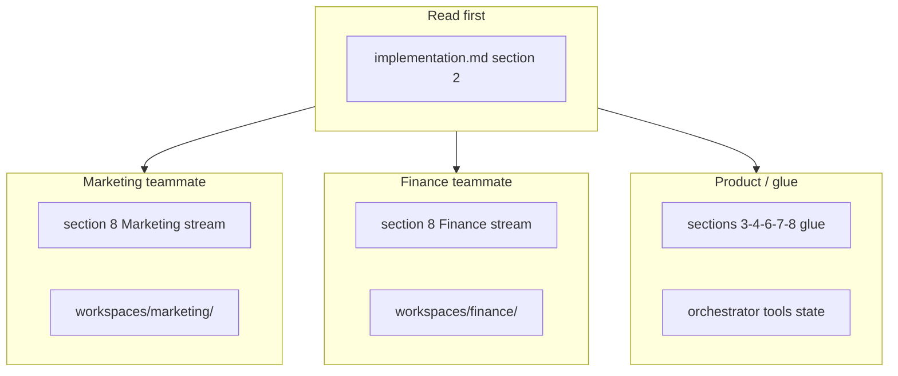
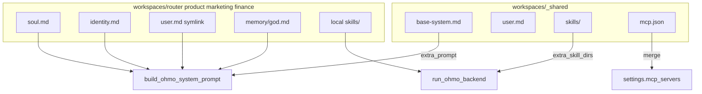
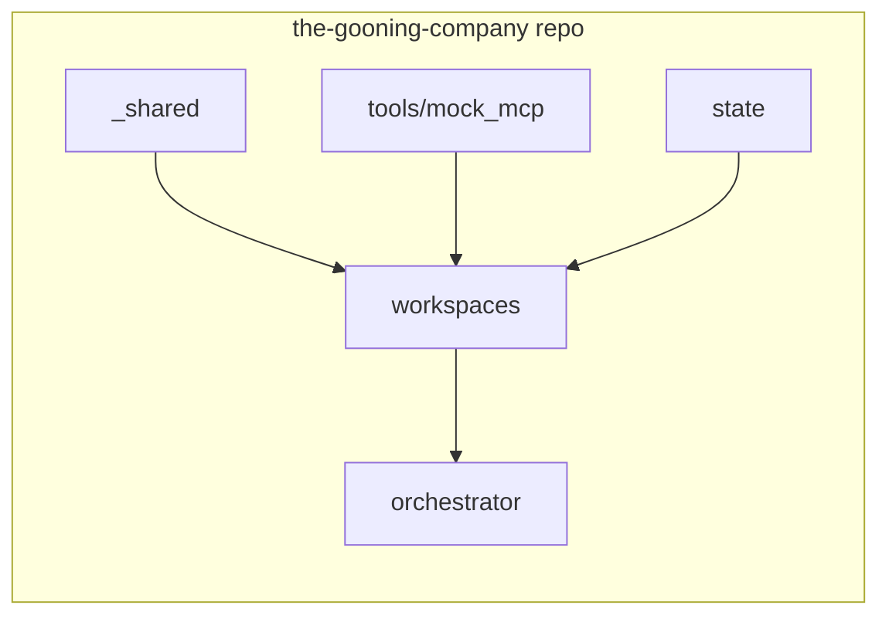
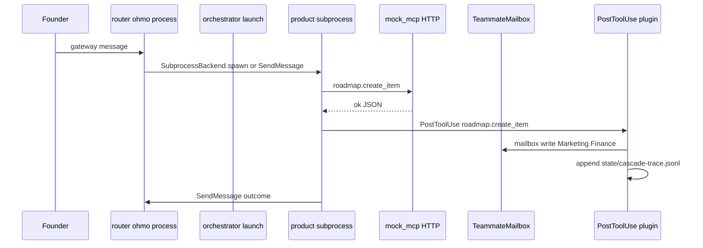

# Implementation runbook — from zero to shippable on OpenHarness

Companion to [dev-concepts `README.md`](README.md) (invariants) and root [`AGENTS.md`](../AGENTS.md). For teammates who are **not** familiar with OpenHarness: read §2 first, then your work stream in §8.

---

## 1. TL;DR

- **Four** ohmo workspaces live **inside this repo** under `workspaces/{router,product,marketing,finance}/` — committed, shareable, no dependency on `~/.ohmo` if you always launch with an explicit `--workspace` (or `OHMO_WORKSPACE`).
- **One** shared folder `workspaces/_shared/` holds common system text, shared skills, shared founder `user.md`, and a shared MCP config fragment.
- **One** mock MCP server under `tools/mock_mcp/`; **one** thin launcher under `orchestrator/launch.py` that wires `extra_prompt`, `extra_skill_dirs`, swarm spawn, and merged MCP settings.
- **No fork** of OpenHarness unless we hit a hard blocker (see §5).



---

## 2. OpenHarness in five minutes

**What it is.** [OpenHarness](https://github.com/HKUDS/OpenHarness) is a Python **agent harness**: tool loop, permissions, hooks, MCP client, skills, plugins, memory, multi-agent **swarm**, and optional **ohmo** (personal agent with its own workspace + gateway).

**CLIs you care about.**

- `oh` — general harness / coding agent loop ([README Quick Start](https://github.com/HKUDS/OpenHarness/blob/main/README.md)).
- `ohmo` — same harness stack, but with a **dedicated workspace** (files under a root you choose) and optional **gateway** (Slack, Telegram, Discord, Feishu per upstream docs).

**Ohmo workspace layout** (upstream seeds these via [`ohmo/workspace.py`](https://github.com/HKUDS/OpenHarness/blob/main/ohmo/workspace.py)):

| Path | Role |
|------|------|
| `soul.md` | Persona and boundaries |
| `identity.md` | Short “who is this agent” |
| `user.md` | Human / founder profile |
| `BOOTSTRAP.md` | First-run ritual (optional) |
| `memory/` | Durable notes; includes `MEMORY.md` index and our `god.md` |
| `skills/` | Markdown skills (on-demand knowledge) |
| `plugins/` | Claude-style plugins (commands, hooks, agents) |
| `sessions/`, `logs/`, `attachments/` | Runtime; usually not committed |
| `state.json`, `gateway.json` | Workspace + channel config |

**System prompt stack** ([`ohmo/prompts.py`](https://github.com/HKUDS/OpenHarness/blob/main/ohmo/prompts.py)): base harness prompt → optional **`extra_prompt`** (“Additional Instructions”) → `soul.md` → `identity.md` → `user.md` → `BOOTSTRAP.md` → workspace memory (`load_ohmo_memory_prompt`) → optional project `CLAUDE.md` (`load_project_memory_prompt`).

**Skills vs plugins.** Skills are `.md` files loaded on demand. Plugins bundle commands, hooks, and optional MCP server entries ([`src/openharness/mcp/config.py`](https://github.com/HKUDS/OpenHarness/blob/main/src/openharness/mcp/config.py) merges `settings.mcp_servers` with plugin MCP configs).

**MCP.** The harness is an MCP **client**; you point `settings.json` at servers (stdio or HTTP per upstream). Same server URL in all four workspaces = one shared mock tool process.

**Swarm.** Multi-agent coordination: [`TeammateSpawnConfig`](https://github.com/HKUDS/OpenHarness/blob/main/src/openharness/swarm/types.py), [`SubprocessBackend`](https://github.com/HKUDS/OpenHarness/blob/main/src/openharness/swarm/subprocess_backend.py), file-backed [`TeammateMailbox`](https://github.com/HKUDS/OpenHarness/blob/main/src/openharness/swarm/mailbox.py), and harness tools like **`SendMessage`**. README “Swarm Coordination” is the map.

---

## 3. In-repo, shippable workspaces

**Resolution order** ([`get_workspace_root`](https://github.com/HKUDS/OpenHarness/blob/main/ohmo/workspace.py)):

1. Explicit `workspace` argument passed to `run_ohmo_backend(..., workspace=Path)` or CLI `--workspace <path>`
2. Else `OHMO_WORKSPACE` environment variable
3. Else `~/.ohmo`

**Implication:** if every launch uses `workspace=<repo>/workspaces/product` (etc.), nothing lives under the default `~/.ohmo` for this product. The repo **is** the project.

**Worked example (conceptual):**

```bash
# From repo root; exact flags follow upstream `ohmo --help`
export OHMO_WORKSPACE="$(pwd)/workspaces/product"
ohmo gateway run   # or whatever entrypoint you standardize on
```

Or your `orchestrator/launch.py` passes `workspace=repo_root / "workspaces" / "product"` into `run_ohmo_backend` ([`ohmo/runtime.py`](https://github.com/HKUDS/OpenHarness/blob/main/ohmo/runtime.py)).

### Commit vs gitignore

| Commit | Reason |
|--------|--------|
| `workspaces/*/soul.md`, `identity.md`, `BOOTSTRAP.md` | Persona and role |
| `workspaces/*/memory/god.md`, `memory/MEMORY.md` | Living docs; team-visible drift |
| `workspaces/*/skills/`, `plugins/` | Domain + router behavior |
| `workspaces/*/settings.json` | Harness config (no secrets) |
| `workspaces/*/gateway.json` | Channel list + **profile name** only (no tokens) |
| `workspaces/_shared/**` | Shared base |
| `state/roadmap.md` (or `.json` once chosen) | Canonical roadmap |

| Gitignore (repo root `.gitignore`) | Reason |
|-----------------------------------|--------|
| `workspaces/*/sessions/` | Ephemeral sessions |
| `workspaces/*/logs/`, `workspaces/*/attachments/` | Noise / large |
| `workspaces/*/state.json` | Local session pointer; can differ per machine |
| `workspaces/*/gateway-restart-notice.json` | Ephemeral |
| `state/cascade-trace.jsonl` | Run log; regenerate |
| `**/.credentials*`, `**/auth.json` | Never commit secrets |

---

## 4. Sharing the base system across agents

Three injection points (no fork):

1. **`extra_prompt`** — launcher reads `workspaces/_shared/base-system.md` and passes it into `build_ohmo_system_prompt(..., extra_prompt=...)`. Same file for all four agents → shared guardrails and company context.
2. **`extra_skill_dirs`** — launcher passes `(repo / "workspaces" / "_shared" / "skills",)` to `run_ohmo_backend` for every process. Shared playbooks (e.g. cascade etiquette, how to read `state/roadmap.*`).
3. **MCP merge** — `workspaces/_shared/mcp.json` holds the `mcp_servers` dict fragment; launcher merges into each workspace’s effective settings before start (OpenHarness does not transitive-import settings files).

**Founder profile:** each `workspaces/<role>/user.md` is a **symlink** to `../_shared/user.md` (one source of truth; `get_user_path` still works).



---

## 5. Do we need a fork?

| Need | Covered by |
|------|------------|
| Four isolated agents | Four directories + explicit `workspace=` |
| Shared prompts / skills | `_shared/` + `extra_prompt` + `extra_skill_dirs` |
| Mock tools | Our MCP server + `mcp_servers` in settings |
| Router-brokered cascade | Swarm + router plugin hooks + mailbox |
| Per-agent deny rules | `settings.json` `permission.path_rules` and/or plugins |

**Fork only if** we need to change harness internals (e.g. hard-coded assumptions about `~/.ohmo`). Until then: **dependency + repo content + thin launcher**.

---

## 6. Target repo layout

```text
the-gooning-company/
  AGENTS.md
  README.md
  Product-requirement-doc/
  dev-concepts/
    README.md
    implementation.md          # this file
    roadmap-schema.md          # stub (M1)
    ...
  state/
    roadmap.md                 # or roadmap.json (schema TBD)
    cascade-trace.jsonl        # gitignored
  workspaces/
    _shared/
      base-system.md
      user.md
      skills/
      mcp.json
    router/
      soul.md identity.md BOOTSTRAP.md settings.json
      user.md -> ../_shared/user.md
      memory/god.md memory/MEMORY.md
      skills/ plugins/
    product/
      ...
    marketing/
      ...
    finance/
      ...
  tools/
    mock_mcp/                  # Python MCP server (HTTP)
  orchestrator/
    launch.py                  # spawns router + teammates; merges config
  dashboard/                   # optional (M3)
```



---

## 7. End-to-end request flow (illustrative)

Concrete names are targets for M2; adjust to match upstream tool / hook APIs when coding.



---

## 8. Work streams — atomic tasks

Each task: **Owner** | **What** | **Why** | **Outputs** | **Done when**

### 8.1 Product / glue

| # | Owner | What | Why | Outputs | Done when |
|---|-------|------|-----|---------|-----------|
| 1 | Glue | Add `openharness-ai` to `pyproject.toml` via `uv add openharness-ai` with pinned version; commit `uv.lock` | Repro across 3 devs | Version line + lockfile | `uv sync` succeeds on clean checkout |
| 2 | Glue | Create `workspaces/_shared/base-system.md`, `user.md`, empty `skills/`, `mcp.json` fragment | Single source for company + founder + MCP server list | Files in repo | Teammates can edit without merge conflicts on soul |
| 3 | Glue | Seed `workspaces/{router,product,marketing,finance}/` via `initialize_workspace(path)` or `ohmo init` with explicit path; replace each `user.md` with symlink to `../_shared/user.md` | In-repo homes | Four trees + symlinks | `get_user_path` resolves shared file |
| 4 | Glue | Draft role-specific `soul.md` / `identity.md` per workspace | Agents diverge only where needed | Four personas | Smoke: each process starts with distinct system tail |
| 5 | Glue | Add `state/roadmap.md` v0 + stub `dev-concepts/roadmap-schema.md` | Unblocks tools + readers | Kanban-shaped doc + schema notes | Marketing/Finance can point skills at real paths |
| 6 | Glue | Skeleton `tools/mock_mcp/` (HTTP); implement `roadmap.*` first; persist to `state/` | Earliest demo | Runnable server + tools | Product agent can call tools end-to-end |
| 7 | Glue | `orchestrator/launch.py`: load `base-system.md` → `extra_prompt`; pass `_shared/skills` as `extra_skill_dirs`; merge `mcp.json` into settings; spawn teammates with `SubprocessBackend` + `workspace=…/workspaces/<role>` | Router topology without fork | Script + README snippet | Four processes, explicit repo paths |
| 8 | Glue | Router plugin `workspaces/router/plugins/router-fanout/`: `PostToolUse` on `roadmap.*` → write [`TeammateMailbox`](https://github.com/HKUDS/OpenHarness/blob/main/src/openharness/swarm/mailbox.py) messages to Marketing + Finance | Cascade without P2P | Plugin dir | Mailbox files appear on roadmap write |
| 9 | Glue | Same hook: append redacted JSON line to `state/cascade-trace.jsonl` | Dashboard trace | Log file | Line per mutating tool |
| 10 | Glue | Fill [`Product-requirement-doc/router.md`](../Product-requirement-doc/router.md) + [`product.md`](../Product-requirement-doc/product.md) with real tool names + payloads | Contract is integration surface | Updated PRD | Marketing/Finance tasks reference same names |
| 11 | Glue | One founder message → router → product → tool → hook → mailbox + trace | Proves M2 | Screenshot or log | End-to-end green |

### 8.2 Marketing agent (teammate 1)

| # | Owner | What | Why | Outputs | Done when |
|---|-------|------|-----|---------|-----------|
| 1 | Mkt | `workspaces/marketing/soul.md`: brand voice + **never mutate roadmap** | Policy in prompt | Edited file | Review with glue |
| 2 | Mkt | `identity.md` + `memory/god.md` seed (campaigns, positioning, threads) | Living doc | Files | god.md loads in session |
| 3 | Mkt | `workspaces/marketing/skills/*.md` (e.g. `campaign-brief.md`, `positioning-review.md`) | Reusable playbooks | 1–2 skills | Skill discoverable in harness |
| 4 | Mkt | `tools/mock_mcp/marketing.py`: `marketing.create_campaign`, `list_campaigns`, `estimate_reach` (mock JSON) | Structured tool surface | Code + schemas draft | Router can cite tool outputs |
| 5 | Mkt | [`Product-requirement-doc/marketing.md`](../Product-requirement-doc/marketing.md): outbound events (`marketing.campaign_started`, etc.) | Finance + router react | Doc | Glue maps hook fan-out |
| 6 | Mkt | Mini integration: roadmap delta → router summary → Marketing → `campaign.drafted` | Closes loop | Log + PR note | Recorded in trace |

### 8.3 Finance agent (teammate 2)

| # | Owner | What | Why | Outputs | Done when |
|---|-------|------|-----|---------|-----------|
| 1 | Fin | `workspaces/finance/soul.md`: conservative modeling + escalation rules | Policy | File | Review with glue |
| 2 | Fin | `identity.md` + `memory/god.md` (assumptions, runway, scenarios) | Living doc | Files | god.md loads |
| 3 | Fin | `workspaces/finance/skills/*.md` (`projection-update.md`, `risk-flag.md`) | Playbooks | Skills | Same as marketing |
| 4 | Fin | `tools/mock_mcp/finance.py`: `finance.project_runway`, `finance.estimate_campaign_cost` | Mock projections | Code | Tools callable |
| 5 | Fin | [`Product-requirement-doc/finance.md`](../Product-requirement-doc/finance.md): inbound (`roadmap.changed`, `marketing.campaign_started`) + outbound (`finance.risk_flag`, …) | Contract | Doc | Glue + Mkt align |
| 6 | Fin | Mini integration: campaign event → router → Finance → estimate + risk flag | Second cascade arm | Log | Trace shows full chain |

---

## 9. How it all fits (ownership / interfaces)

| Layer | Who edits | Who reads | Boundary |
|-------|-----------|-----------|----------|
| `workspaces/_shared/*` | Glue (PR review from all) | All harness processes | Company-wide only |
| `workspaces/<role>/soul.md` + `identity.md` | Role owner | That process only | Domain voice |
| `memory/god.md` | Role owner | That process + dashboard | Private per agent |
| `state/roadmap.*` | Product (tools + permissions) | All + dashboard | Single source of truth |
| `tools/mock_mcp/*` | Split by domain files; glue owns server main | All agents via MCP | Tool contracts in PRD |
| `orchestrator/launch.py` | Glue | Operators | Spawn + merge only |
| Swarm mailbox + plugins | Glue + router | Runtime | Cascade only through router |

---

## 10. Milestones

| Milestone | Scope | Exit criteria |
|-----------|--------|----------------|
| **M1** (day 1–2) Walking skeleton | Four in-repo workspaces; launcher starts router + one domain path; one round-trip message | Founder message → router → one agent text reply; no MCP; no cascade |
| **M2** (day 3–4) Cascade | `roadmap.*` + PostToolUse fan-out + trace | Roadmap write → mailbox entries to Mkt+Fin + `cascade-trace.jsonl` line |
| **M3** (day 5–6) Dashboard + polish | Autopilot snapshot **or** minimal web UI | Read-only `god.md` + roadmap + trace tail; demo script checked in |

---

## 11. Known risks / defer

1. **Per-agent MCP permissioning** — if `settings.json` `path_rules` are insufficient to block `roadmap.*` on non-Product agents, add a small plugin that denies tool names by prefix at PreToolUse.
2. **Subprocess teammate restarts** — if a child crashes, launcher may need a supervisor loop (retry with backoff); defer until M1 shows pain.
3. **`gateway.json` provider profiles** — document which `provider_profile` each process uses; credentials stay on each machine (`oh auth` / upstream wizard), never in git.

---

## 12. Upstream pointers (keep these open while coding)

| Topic | URL |
|-------|-----|
| Workspace paths + templates | [`ohmo/workspace.py`](https://github.com/HKUDS/OpenHarness/blob/main/ohmo/workspace.py) |
| Prompt assembly + `extra_prompt` | [`ohmo/prompts.py`](https://github.com/HKUDS/OpenHarness/blob/main/ohmo/prompts.py) |
| Backend host + `extra_skill_dirs` | [`ohmo/runtime.py`](https://github.com/HKUDS/OpenHarness/blob/main/ohmo/runtime.py) |
| Swarm types | [`src/openharness/swarm/types.py`](https://github.com/HKUDS/OpenHarness/blob/main/src/openharness/swarm/types.py) |
| Mailbox | [`src/openharness/swarm/mailbox.py`](https://github.com/HKUDS/OpenHarness/blob/main/src/openharness/swarm/mailbox.py) |
| Subprocess backend | [`src/openharness/swarm/subprocess_backend.py`](https://github.com/HKUDS/OpenHarness/blob/main/src/openharness/swarm/subprocess_backend.py) |
| MCP config merge | [`src/openharness/mcp/config.py`](https://github.com/HKUDS/OpenHarness/blob/main/src/openharness/mcp/config.py) |
| MCP client | [`src/openharness/mcp/client.py`](https://github.com/HKUDS/OpenHarness/blob/main/src/openharness/mcp/client.py) |
| Product overview | [OpenHarness README](https://github.com/HKUDS/OpenHarness/blob/main/README.md) — Quick Start, Plugins, Swarm Coordination |

---

## Cross-links

- Invariants and OpenHarness mapping: [`README.md`](README.md) in this folder.
- Product intent: root [`AGENTS.md`](../AGENTS.md).
- Per-agent contracts: [`../Product-requirement-doc/README.md`](../Product-requirement-doc/README.md).
